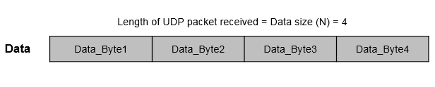

# packets_path
Sending packets via UDP protocol and receiving the same. Also working for sending packets via Ethernet using Matlab and Simulink

#Matlab UDP.

#UDP send
The UDP Send block sends an input vector as UDP packets over an IP network port to a UDP host. Use the block for stateless and connectionless data transmission.

The block sends packets from the port number specified in the Local IP Port (-1 for automatic port assignment) parameter.

Specify the IP address and the port number of the receiving host in the Remote IP address (255.255.255.255 for broadcast) and Remote IP Port parameter.

#UDP receive
The UDP Receive block receives UDP packets from a UDP host. Use the block for stateless and connectionless data transmission.

With each sample, the block outputs the contents of a UDP packet as a data vector of the size that you specify in the Data size (N) parameter.

The block receives the packets on the port number specified in the Local IP Port parameter from the IP address specified in the Remote IP address (0.0.0.0 for accepting all) parameter. To receive packets from all the sending hosts, specify the remote IP address as 0.0.0.0. Match the port number specified in the Local IP Port parameter with the remote port number of the sending host.

#Receieve UDP packets

#Length of UDP Packets received.

This example describes the values at the output ports when the length of the packets received is less than, greater than, or equal to the length of requested data.

Length of UDP packet received = Data size (N): The Data port outputs the packet as a data vector of the size specified in the Data size (N) parameter.

The Status port outputs 0, indicating that the requested data is received.

Suppose that the Data size (N) parameter specified is 4 and the length of the packet received is also 4.

In this case, the Data port outputs a data vector of size 4 filled with the elements of the packet.

